************************************************
code carousel
      <!-- <h3>Les moyens de locomotion</h3> -->
        

            

                

                    <button class="nav left">&#10094;</button>
                    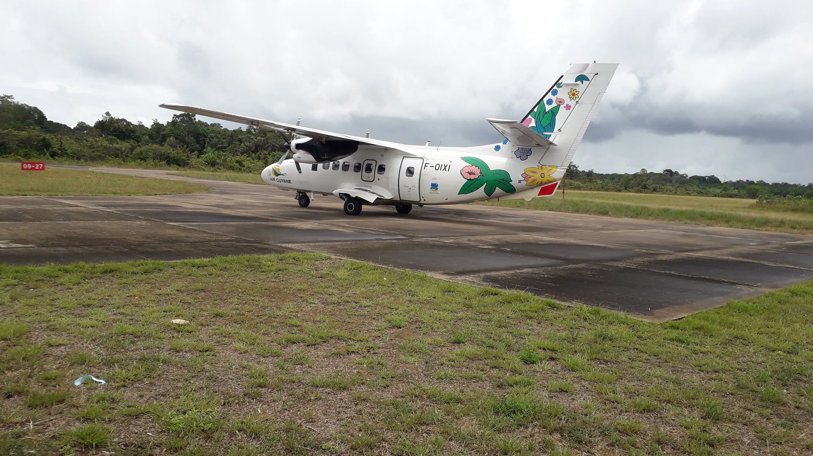
                    <button class="nav right">&#10095;</button>
                

                

                    
                   
                    <!-- 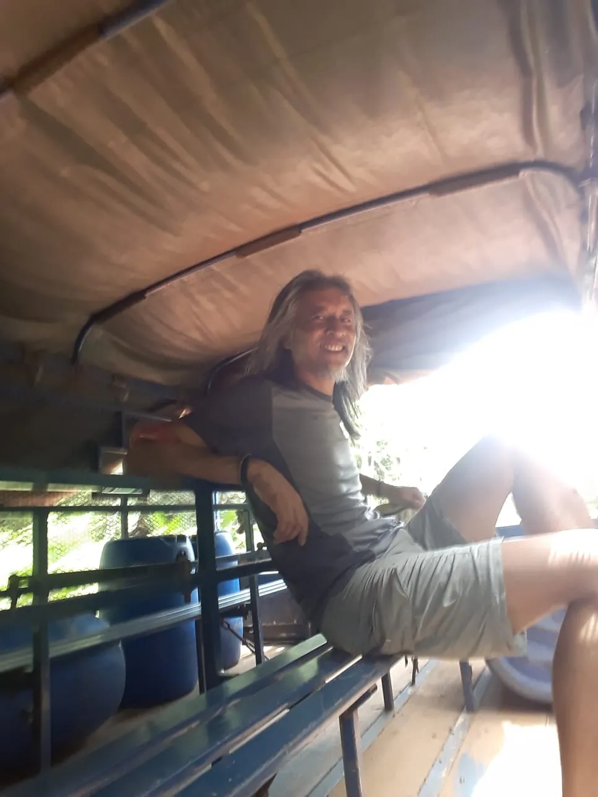   -->
                

            

        
       

************************************************
code galerie photo
             

                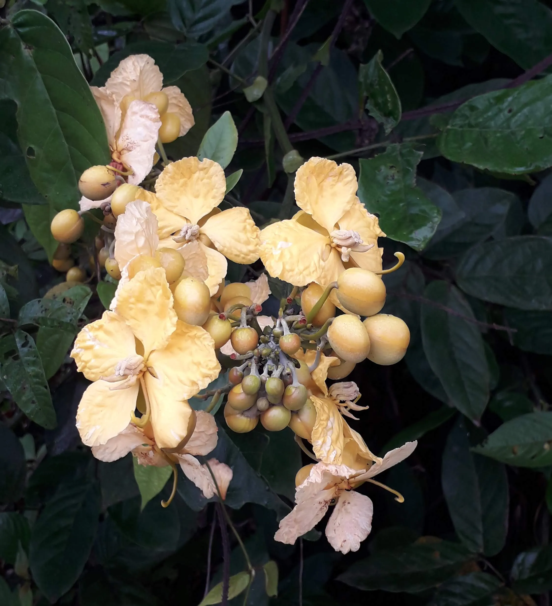
                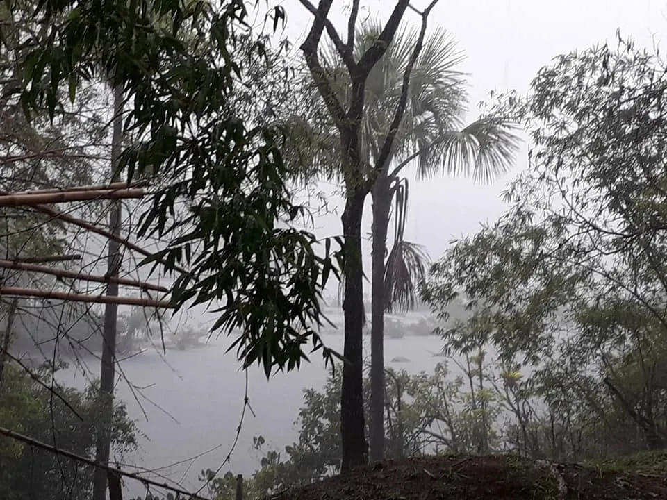
                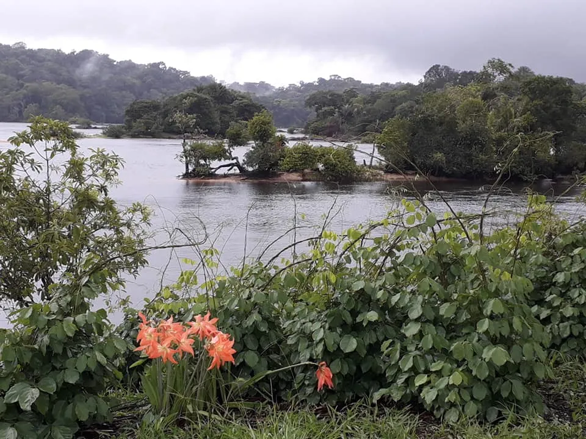
                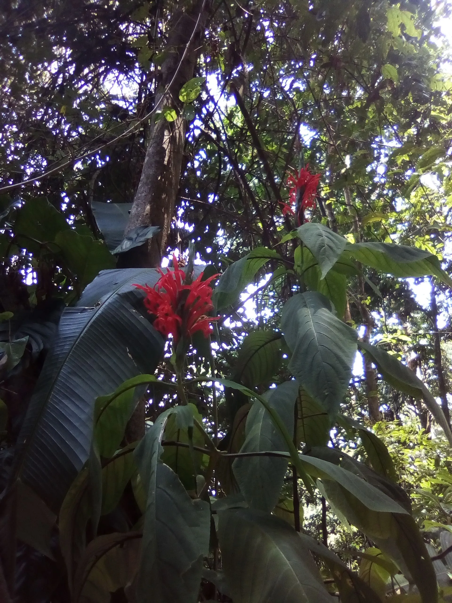
                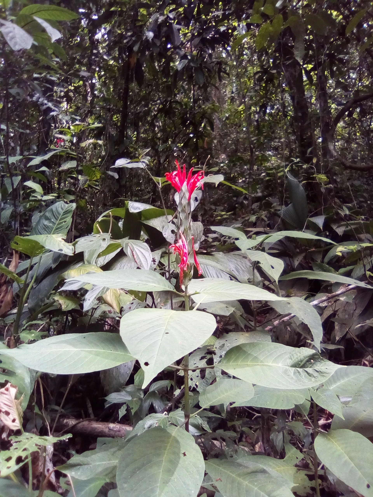
                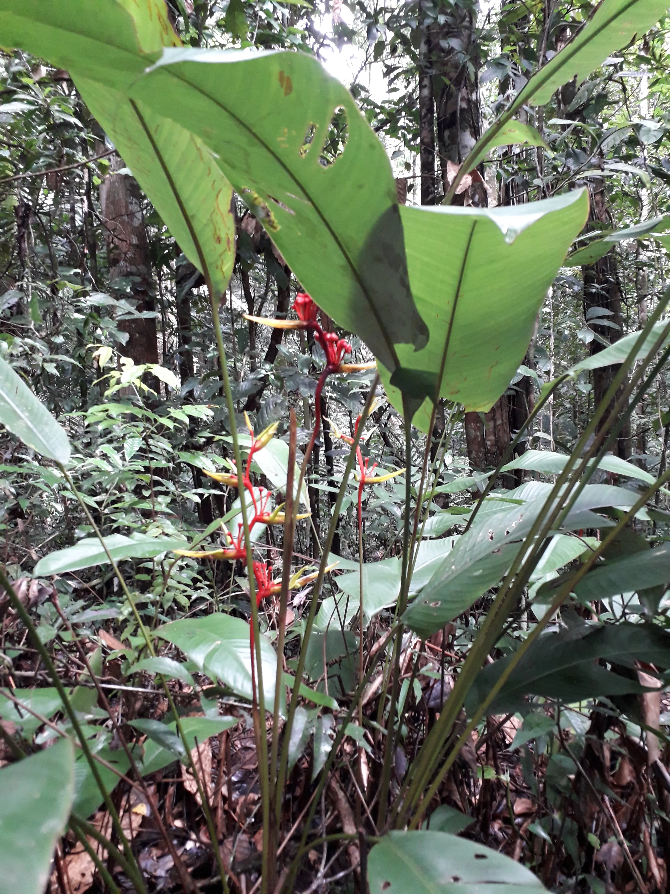
                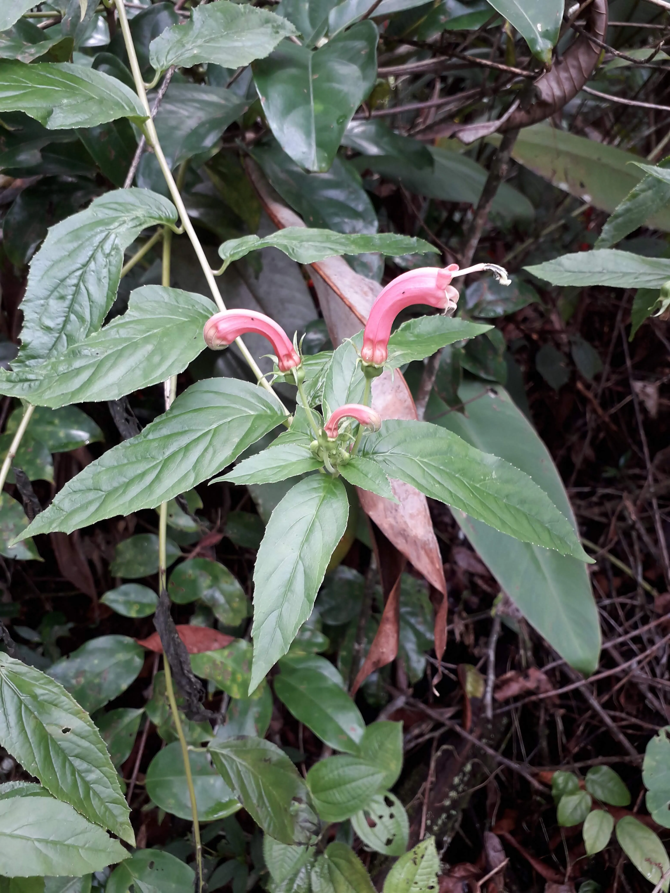
                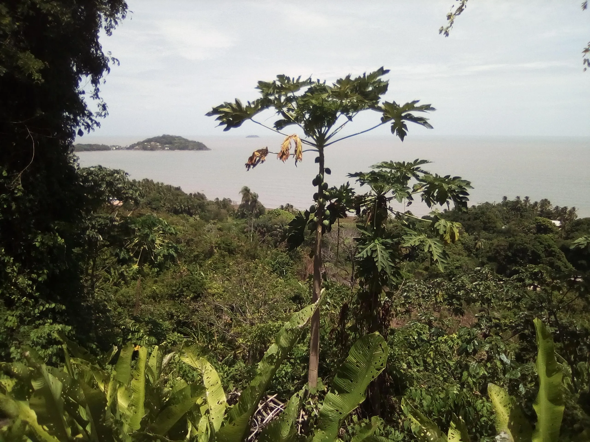
                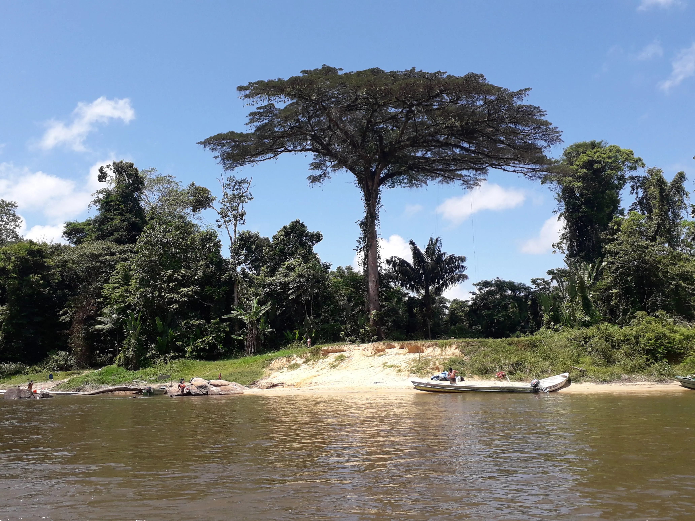
                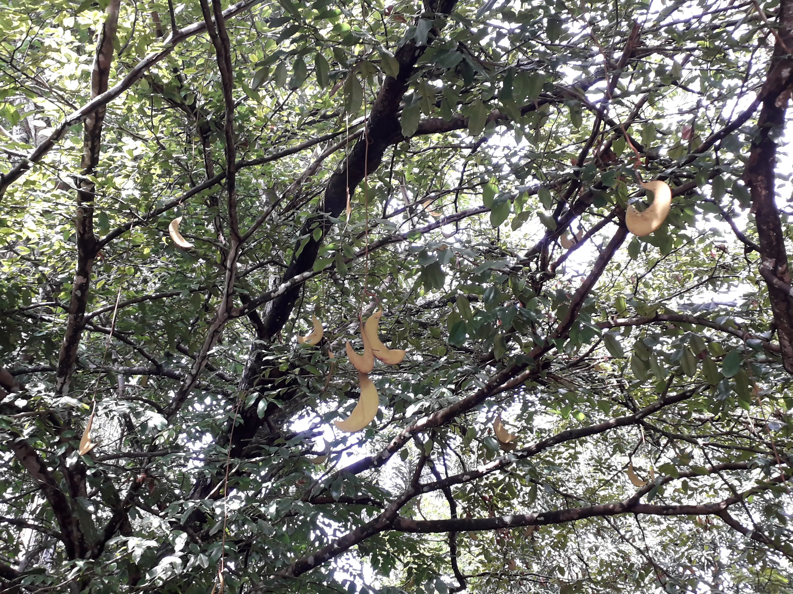         
            

****************************************************
image a 75% et 100% responsive
 

      
       
        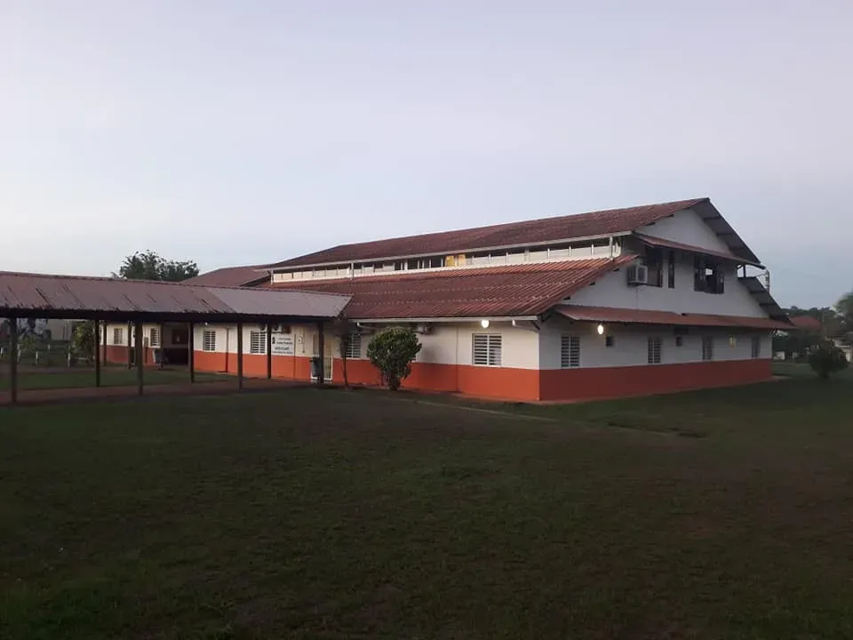
        

          Saint Georges de l'Oyapocke
        

         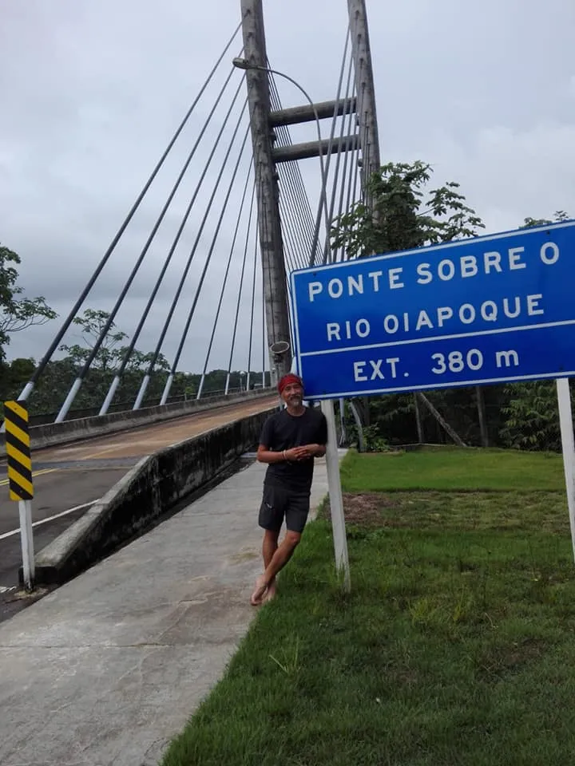
      
        
    
 
*******************************************************
seion video

            <video controls width="80%" poster="assets/apercu.jpg">
              <source src="./videos/20190723_111725.mp4" type="video/mp4" />
          </video>
          

             

                      Grand Santi          
            
   

           

